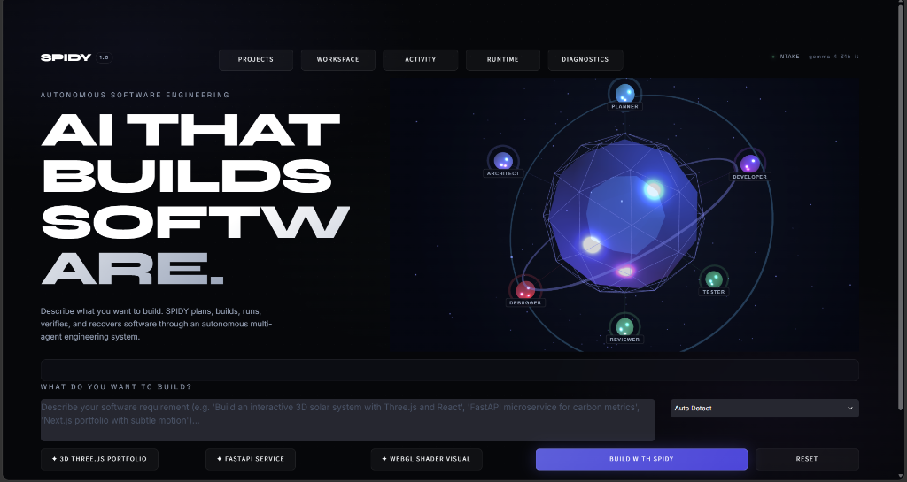
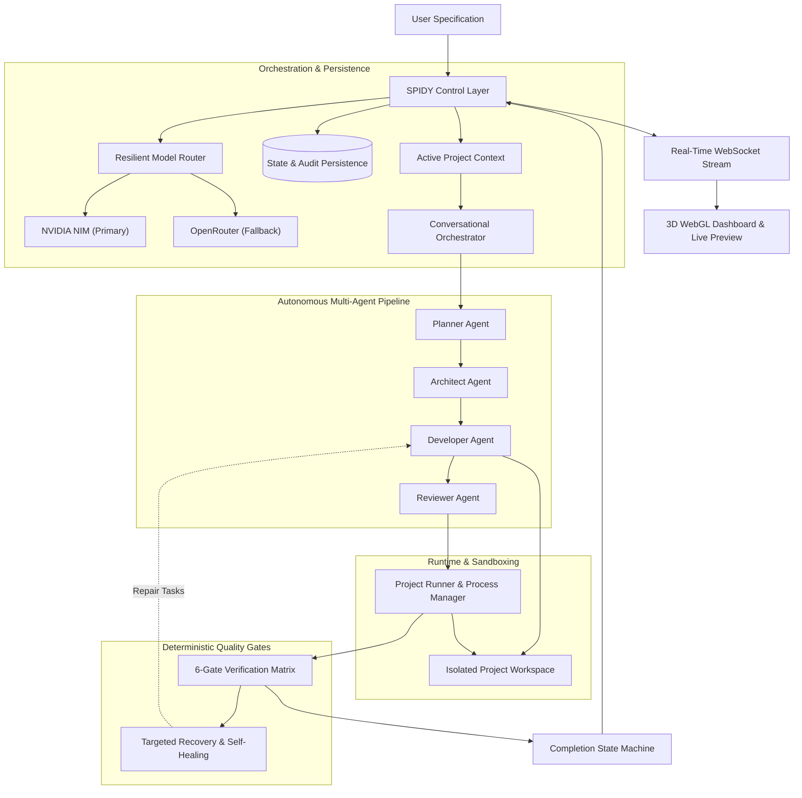

# SPIDY

### Autonomous Software Engineering

SPIDY turns natural-language software requirements into working applications by planning, implementing, running, testing, recovering from failures, and verifying the resulting software.

[](https://python.org)
[](https://react.dev)
[](https://www.typescriptlang.org)
[](https://threejs.org)
[](https://fastapi.tiangolo.com)
[](https://sqlite.org)
[](tests/)
[](LICENSE)

---



---

## 1. What SPIDY Does

Most AI coding assistants function as conversational autocomplete tools or code-block generators. They produce unverified snippets that still require a developer to manually create project structures, configure dependencies, start runtime servers, resolve port conflicts, debug startup crashes, and verify functionality.

SPIDY operates as an autonomous engineering pipeline that takes an application request from concept to running software:

- **Decomposes Specifications**: Identifies required technology stacks (FastAPI, React/Vite, SQLite, Python CLI, HTML/JS) and builds a topologically sorted task dependency graph.
- **Enforces Architectural Contracts**: Generates directory schemas, database tables, and API route contracts before generating implementation code.
- **Synthesizes Multi-File Codebases**: Writes coordinated source files directly into dedicated, isolated workspaces.
- **Manages Runtimes & Ephemeral Ports**: Allocates free ports in the `9000+` range and boots background processes without port collision.
- **Validates Through Deterministic Gates**: Applies a 6-gate validation matrix (specification alignment, structural completeness, AST syntax, runtime health, asset integrity, and code quality audits).
- **Performs Targeted Self-Healing**: Automatically diagnoses 404s, missing entrypoints, and syntax errors through bounded recovery cycles.
- **Streams Real-Time Telemetry**: Broadcasts live build events, task statuses, and embedded live application previews to an interactive 3D WebGL dashboard.

---

## 2. Autonomous Engineering Workflow

SPIDY structures software development into eight discrete, reproducible phases:

```
 Natural Language Specification (e.g. "Build an expense tracker with FastAPI, React, and SQLite")
                                        │
                                        ▼
   ┌────────────────────────────────────────────────────────────────────────┐
   │ 1. Classification & Context Isolation                                  │
   │    ActiveProjectContext isolates the build to prevent cross-run leaks  │
   └────────────────────────────────────┬───────────────────────────────────┘
                                        │
                                        ▼
   ┌────────────────────────────────────────────────────────────────────────┐
   │ 2. Planning (Planner Agent)                                            │
   │    Detects stack requirements and generates a directed task graph      │
   └────────────────────────────────────┬───────────────────────────────────┘
                                        │
                                        ▼
   ┌────────────────────────────────────────────────────────────────────────┐
   │ 3. Architecture & Contracts (Architect Agent)                          │
   │    Defines file tree, shared models, database schemas, and endpoints   │
   └────────────────────────────────────┬───────────────────────────────────┘
                                        │
                                        ▼
   ┌────────────────────────────────────────────────────────────────────────┐
   │ 4. Code Synthesis (Developer Agent)                                    │
   │    Generates multi-file codebases in workspace/<project_id>/           │
   └────────────────────────────────────┬───────────────────────────────────┘
                                        │
                                        ▼
   ┌────────────────────────────────────────────────────────────────────────┐
   │ 5. Runtime Execution (Project Runner & Process Manager)                │
   │    Discovers free ephemeral ports (9000+) & launches live processes    │
   └────────────────────────────────────┬───────────────────────────────────┘
                                        │
                                        ▼
   ┌────────────────────────────────────────────────────────────────────────┐
   │ 6. Deterministic 6-Gate Verification (Reviewer Agent & Validators)     │
   │    Spec Alignment ➔ Structure ➔ AST Syntax ➔ Port/HTTP ➔ Assets ➔ Audit│
   └────────────────────────────────────┬───────────────────────────────────┘
                                        │
                        ┌───────────────┴───────────────┐
                        │                               │
                [Gate Fails]                    [All Gates Pass]
                        │                               │
                        ▼                               ▼
   ┌─────────────────────────────────────────┐   ┌──────────────────────────┐
   │ 7. Targeted Self-Healing                │   │ 8. Verified Success      │
   │    Bounded recovery loop for runtime    │   │    Live preview served,  │
   │    exceptions and missing components    │   │    full telemetry to DB  │
   └─────────────────────────────────────────┘   └──────────────────────────┘
```

---

## 3. Core Capabilities Implemented

The following features are fully implemented and verified in the current codebase:

- **Multi-Agent Pipeline**: Specialized agents for planning (`PlannerAgent`), system architecture (`ArchitectAgent`), code synthesis (`DeveloperAgent`), and verification (`ReviewerAgent`).
- **Project Context Isolation**: `ActiveProjectContext` strictly isolates consecutive runs, preventing cross-project pollution between disparate application requests.
- **Architectural Contract Generation**: Enforces schema and endpoint definitions prior to code generation via `architecture_contract.py`.
- **Supported Application Stacks**:
  - Full-stack web applications (FastAPI backend + React/Vite/TypeScript frontend + SQLite database).
  - Standalone FastAPI REST microservices.
  - Interactive HTML5 / JavaScript / WebGL frontend applications.
  - Python CLI applications and algorithmic utilities.
- **Dynamic Port Allocation & Process Supervision**: Background processes bind to dynamically detected ports in the `9000–65535` range, protecting control ports (`8500–8502`).
- **Deterministic 6-Gate Verification Matrix**:
  1. *Specification Alignment*: Confirms planned tasks address user requirements.
  2. *Structural Completeness*: Verifies all contract-specified files exist on disk.
  3. *Syntax & AST Parsing*: Validates Python AST and JS/TS syntax across all generated files.
  4. *Runtime & Socket Health*: Probes allocated ports and confirms live HTTP responses.
  5. *Asset & File Integrity*: Confirms files and stylesheets are non-empty and uncorrupted.
  6. *Reviewer Agent Gate*: Executes automated quality audits and invariant checks.
- **Resilient Multi-Provider LLM Routing**: Primary routing to NVIDIA NIM (`z-ai/glm-5.3`, `nvidia/nemotron-3.5`, `google/gemma-4-31b`) with automatic failover to OpenRouter (`openrouter/free`).
- **SQLite WAL Mode Persistence**: Complete state persistence across projects, builds, agent activities, runtime sessions, and messages with startup reconciliation for interrupted builds.
- **3D Real-Time Dashboard**: Three.js WebGL scene with agent constellation nodes, live telemetry data streams, active build HUD, project history drawer, and embedded live iframe preview.

---

## 4. Architecture Overview



For comprehensive architectural details, consult the [System Architecture Guide](docs/architecture/overview.md).

---

## 5. Example Workflow

1. **User Requirement**:
   > *"Build a personal task manager called FocusFlow with React, TypeScript, FastAPI, and SQLite."*
2. **Scoping & Classification**:
   `TaskClassifier` identifies this as a fresh full-stack application and initializes a new isolated workspace at `workspace/proj_<id>/`.
3. **Planning & Architecture**:
   `PlannerAgent` creates tasks for backend configuration, database models, CRUD endpoints, React frontend, and integration. `ArchitectAgent` defines the schema models and REST endpoints (`GET /api/tasks`, `POST /api/tasks`, `DELETE /api/tasks/{id}`).
4. **Synthesis & Execution**:
   `DeveloperAgent` writes the FastAPI server, SQLite database layer, Vite configuration, and React components. `ProjectRunner` allocates ephemeral port `9001` for FastAPI and port `9002` for Vite, booting both in the background.
5. **Verification & Delivery**:
   All 6 gates pass. The live application preview is embedded directly in the SPIDY dashboard.

---

## 6. Quick Start

### Prerequisites
- **Python**: 3.10+ (tested on Python 3.11 and 3.14)
- **Node.js**: 18+ (tested on Node.js 20+)
- **Git**

### 1. Clone the Repository
```bash
git clone https://github.com/Charan877/Spidy.git
cd Spidy
```

### 2. Set Up Python Virtual Environment
```bash
python -m venv .venv

# On Windows:
.\.venv\Scripts\Activate.ps1

# On Linux / macOS:
source .venv/bin/activate

# Install Python dependencies:
pip install -r requirements.txt
```

### 3. Build Frontend Production Assets
```bash
cd frontend
npm install
npm run build
cd ..
```

### 4. Configure Environment
```bash
# Windows:
Copy-Item .env.example .env

# Linux / macOS:
cp .env.example .env
```
Edit `.env` to supply your API credentials:
```ini
NVIDIA_API_KEY=nvapi-your-key-here
OPENROUTER_API_KEY=sk-or-your-key-here
```

### 5. Launch SPIDY
```bash
# Windows Batch Launcher:
run.bat

# Or direct Python server:
python server.py
```
Open your browser to: **`http://localhost:8501`**

---

## 7. Configuration

SPIDY is configured via environment variables in `.env` (template provided in `.env.example`):

| Variable | Description | Default / Recommended |
|---|---|---|
| `NVIDIA_API_KEY` | Primary LLM provider key ([NVIDIA NIM](https://build.nvidia.com)) | Required for primary |
| `NVIDIA_BASE_URL` | Base URL for NVIDIA NIM | `https://integrate.api.nvidia.com/v1` |
| `NVIDIA_PLANNER_MODEL` | Model used for task planning & scoping | `z-ai/glm-5.3` |
| `NVIDIA_ARCHITECT_MODEL` | Model used for system & schema architecture | `z-ai/glm-5.3` |
| `NVIDIA_CODER_MODEL` | Model used for code generation & synthesis | `z-ai/glm-5.3` |
| `OPENROUTER_API_KEY` | Automatic failover provider key ([OpenRouter](https://openrouter.ai)) | Optional fallback |
| `OPENROUTER_BASE_URL` | Base URL for OpenRouter | `https://openrouter.ai/api/v1` |
| `OPENROUTER_MODEL` | Fallback model identifier | `openrouter/free` |
| `PRIMARY_PROVIDER` | Default active provider | `nvidia` |
| `FALLBACK_PROVIDER` | Secondary provider for failover | `openrouter` |
| `LLM_TIMEOUT` | Timeout in seconds per API request | `60` |
| `LLM_MAX_RETRIES` | Maximum retry attempts per failed request | `2` |

---

## 8. Testing

SPIDY includes an automated test suite of **115 unit and integration tests** covering context isolation, database migrations, state machines, ephemeral port allocation, and fallback recovery.

```bash
# Run the full test suite with pytest:
pytest tests -v

# Run with standard Python unittest:
python -m unittest discover -s tests

# Run only unit tests:
pytest tests/unit

# Run only integration tests:
pytest tests/integration
```

For testing principles and fixture details, see the [Testing Strategy](docs/testing/strategy.md).

---

## 9. Project Structure

```
Spidy/
├── backend/                  # Authoritative Python backend application
│   ├── agents/               # Multi-agent implementations (Planner, Architect, Dev, Reviewer)
│   ├── core/                 # Context isolation, architecture contracts, validators, LLM router
│   ├── database/             # SQLite connection factory (WAL mode), migrations, repository APIs
│   ├── orchestration/        # Conversational orchestrator and deterministic state machine
│   ├── runtime/              # Subprocess manager, port detector, preview manager, session runner
│   └── ui/                   # Streamlit fallback UI components
├── frontend/                 # React 18 + Three.js + Tailwind CSS web interface
│   ├── src/
│   │   ├── components/       # Active HUD, navigation, drawers, command panels
│   │   ├── three/            # 3D cinematic canvas, monument, shaders, camera controller
│   │   └── types/            # TypeScript interfaces and telemetry types
│   ├── package.json
│   └── vite.config.ts
├── data/                     # Local data storage (.gitkeep committed, databases ignored)
│   └── spidy.db              # Embedded SQLite database (WAL mode)
├── docs/                     # Technical documentation & assets
│   ├── architecture/         # System design, verification matrix, state machine specs
│   ├── assets/               # Interface screenshots (spidy-interface.png)
│   ├── development/          # Project structure, coding standards, contributing guide
│   └── testing/              # Testing strategy and test execution instructions
├── scripts/                  # Convenience startup scripts (run.bat, run.ps1)
├── tests/                    # Automated test suite (115 unit and integration tests)
│   ├── integration/          # API, persistence, resume, and e2e integration tests
│   └── unit/                 # Agent, router, state machine, and context unit tests
├── workspace/                # Sandboxed project workspaces (workspace/<project_id>/)
├── app.py                    # Dual launcher (Starlette server / Streamlit fallback)
├── server.py                 # Primary backend server entrypoint
├── requirements.txt          # Python dependencies
├── CONTRIBUTING.md           # Contribution guidelines and checklist
├── LICENSE                   # Apache 2.0 open-source license
├── .env.example              # Documented environment variable template
├── .gitignore                # Comprehensive Git exclusion rules
└── README.md                 # Project overview and documentation
```

For directory details and role boundaries, see the [Project Structure Guide](docs/development/project-structure.md).

---

## 10. Documentation

- **[System Architecture](docs/architecture/overview.md)**: Deep dive into the orchestrator, agent contracts, runtime supervisor, and database schema.
- **[Project Structure](docs/development/project-structure.md)**: Complete file tree, module responsibilities, and architectural invariants.
- **[Testing Strategy](docs/testing/strategy.md)**: Test suite architecture, test execution instructions, and regression verification.
- **[Contributing Guide](docs/development/contributing.md)**: Setup workflows, coding conventions, and pull request guidelines.

---

## 11. Current Limitations

- **Host Runtime Availability**: SPIDY synthesizes full-stack applications that run on the host system. Executing generated applications requires relevant runtimes (e.g. Node.js for React/Vite, Python for FastAPI) to be installed on the host.
- **Bounded Self-Healing**: Automated recovery employs bounded retry limits to prevent infinite loops when encountering external or unsolvable dependencies.
- **Local Process Sandboxing**: Applications run as isolated host subprocesses bound to dedicated workspaces and ports, rather than in isolated Docker containers (containerization is planned).

---

## 12. Roadmap

- [ ] **Docker Container Sandboxing**: Optional containerized execution of generated applications.
- [ ] **GitHub Branch & PR Export**: Automatically export generated project workspaces to dedicated GitHub branches.
- [ ] **Multi-Node Swarm Execution**: Distribute compilation, testing, and agent synthesis across networked machines.
- [ ] **Real-Time WebSocket Client Generation**: Automated generation of typed frontend WebSocket clients for bidirectional APIs.

---

## 13. Contributing

Contributions are welcome. Please read our [Contributing Guidelines](docs/development/contributing.md) and [Code of Conduct](CONTRIBUTING.md) before submitting a pull request.

---

## 14. License

This project is licensed under the **Apache 2.0 License** — see the [LICENSE](LICENSE) file for details.