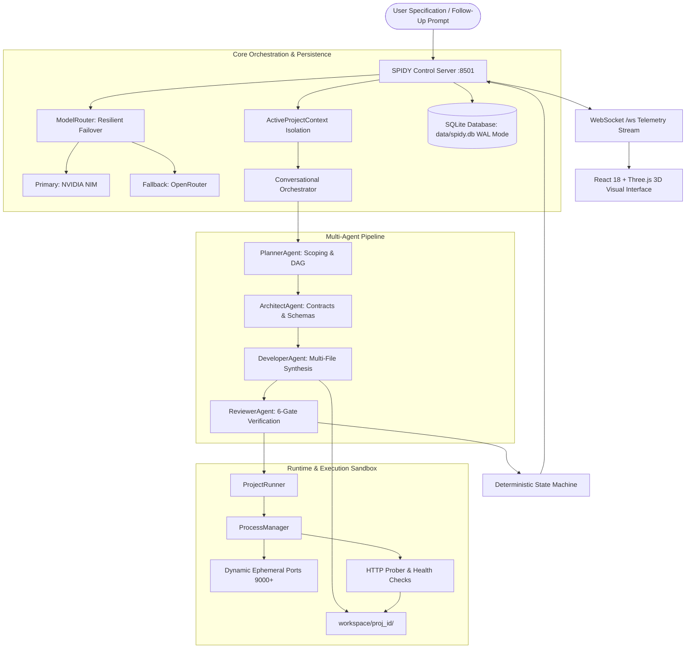

# SPIDY — Autonomous Software Engineering

<div align="center">

```
   ███████╗██████╗ ██╗██████╗ ██╗   ██╗
   ██╔════╝██╔══██╗██║██╔══██╗╚██╗ ██╔╝
   ███████╗██████╔╝██║██║  ██║ ╚████╔╝ 
   ╚════██║██╔═══╝ ██║██║  ██║  ╚██╔╝  
   ███████║██║     ██║██████╔╝   ██║   
   ╚══════╝╚═╝     ╚═╝╚═════╝    ╚═╝   
```

**AI THAT BUILDS SOFTWARE.**

An autonomous multi-agent software engineering system with real-time process execution, deterministic multi-gate verification, and an immersive 3D computational interface.

[](https://python.org)
[](https://react.dev)
[](https://threejs.org)
[](https://fastapi.tiangolo.com)
[](https://sqlite.org)
[](tests/)
[](LICENSE)

---


</div>

---

## 1. What is SPIDY?

Most AI coding assistants operate as conversational autocomplete tools or code-block generators. They provide isolated snippets that still require human engineers to create project scaffolds, resolve dependency conflicts, bind runtime ports, debug startup crashes, and verify end-to-end functionality.

**SPIDY** is an autonomous software engineering platform designed to bridge this gap. Given a high-level natural language specification, SPIDY autonomously:

1. **Plans & Scopes** the application stack and decomposes it into topologically ordered tasks.
2. **Architects System Contracts**, schemas, file trees, and API endpoints before code is written.
3. **Synthesizes Production Code** across frontend, backend, database, and configuration files.
4. **Binds & Runs Live Processes** in isolated sandboxes using dynamic ephemeral port discovery.
5. **Verifies Operational Health** through a deterministic 6-gate validation matrix.
6. **Self-Heals Failures** by analyzing runtime exceptions, missing entrypoints, and socket errors.
7. **Streams Live Telemetry** to an interactive 3D WebGL interface with embedded real-time application previews.

---

## 2. Autonomous Engineering Pipeline

SPIDY replaces ad-hoc LLM generation with a deterministic, role-specialized multi-agent lifecycle:

```
 User Specification (e.g. "Build a full-stack expense tracker with FastAPI, React, and SQLite")
                                        │
                                        ▼
   ┌────────────────────────────────────────────────────────────────────────┐
   │ 1. DISCOVERY & CONTEXT ISOLATION                                       │
   │    ActiveProjectContext isolates builds to prevent cross-run leakage   │
   └────────────────────────────────────┬───────────────────────────────────┘
                                        │
                                        ▼
   ┌────────────────────────────────────────────────────────────────────────┐
   │ 2. PLANNING (PlannerAgent)                                             │
   │    Detects stack (React/Vite, FastAPI, SQLite) & builds task DAG       │
   └────────────────────────────────────┬───────────────────────────────────┘
                                        │
                                        ▼
   ┌────────────────────────────────────────────────────────────────────────┐
   │ 3. ARCHITECTURE (ArchitectAgent)                                       │
   │    Generates full-stack contracts, data schemas, and API route specs  │
   └────────────────────────────────────┬───────────────────────────────────┘
                                        │
                                        ▼
   ┌────────────────────────────────────────────────────────────────────────┐
   │ 4. CODE SYNTHESIS (DeveloperAgent)                                     │
   │    Generates multi-file codebases in workspace/<project_id>/          │
   └────────────────────────────────────┬───────────────────────────────────┘
                                        │
                                        ▼
   ┌────────────────────────────────────────────────────────────────────────┐
   │ 5. RUNTIME EXECUTION (ProjectRunner & ProcessManager)                   │
   │    Discovers free ephemeral ports (9000+) & boots live background apps │
   └────────────────────────────────────┬───────────────────────────────────┘
                                        │
                                        ▼
   ┌────────────────────────────────────────────────────────────────────────┐
   │ 6. DETERMINISTIC 6-GATE VERIFICATION (ReviewerAgent & Validators)      │
   │    Spec Alignment ➔ Structure ➔ AST Syntax ➔ Port/HTTP ➔ Assets ➔ Audit│
   └────────────────────────────────────┬───────────────────────────────────┘
                                        │
                        ┌───────────────┴───────────────┐
                        │                               │
                [Gate Fails]                    [All Gates Pass]
                        │                               │
                        ▼                               ▼
   ┌─────────────────────────────────────────┐   ┌──────────────────────────┐
   │ 7. BOUNDED RECOVERY                     │   │ 8. VERIFIED SUCCESS      │
   │    Targeted repair loops for 404s,      │   │    Live iframe preview,  │
   │    Vite configs, or process crashes     │   │    telemetry logged to DB│
   └─────────────────────────────────────────┘   └──────────────────────────┘
```

---

## 3. System Architecture



### Core Architectural Subsystems

- **Project Context Isolation (`backend/core/active_context.py`)**: Guarantees complete cross-project isolation. Sequential builds (e.g. an algorithmic utility followed by a full-stack web app) are isolated so previous task graphs and schemas never leak into subsequent builds.
- **Resilient Model Routing (`backend/core/llm/model_router.py`)**: Provides resilient LLM routing across multiple providers. Defaults to **NVIDIA NIM** (`z-ai/glm-5.3`, `nvidia/nemotron-3.5`, `google/gemma-4-31b`) with automatic failover to **OpenRouter** (`openrouter/free`) with exponential backoff.
- **Dynamic Runtime Sandboxing (`backend/runtime/`)**: Target applications are isolated in `workspace/<project_id>/`. `ProcessManager` dynamically discovers unused ephemeral ports (`9000–65535`) to avoid collisions with SPIDY's control ports (`8500–8502`).
- **Deterministic 6-Gate Verification**:
  1. *Specification Alignment Gate*: Validates task graph alignment with user specifications before execution.
  2. *Structural Completeness Gate*: Verifies on disk that every file and directory required by the architecture contract was synthesized.
  3. *Syntax & AST Gate*: Parses all Python, TypeScript, and JavaScript files to catch syntax and import errors.
  4. *Runtime & Process Health Gate*: Confirms background processes spawned successfully and sockets bound cleanly.
  5. *Asset & Content Integrity Gate*: Guarantees source files, stylesheets, and documentation are non-empty and free of unpopulated templates.
  6. *Reviewer Agent Gate*: Performs programmatic code-quality verification and invariant checks.
- **Write-Ahead Logging Persistence (`backend/database/`)**: All projects, builds, agent runs, timeline events, runtime sessions, and verification records are persisted in SQLite with WAL mode enabled and automatic startup recovery reconciliation.
- **Cinematic 3D WebGL Interface (`frontend/src/three/`)**: Real-time Three.js / React Three Fiber computational machine with spatial agent constellation nodes, live telemetry data streams, and active build HUD.

---

## 4. Feature Matrix: Implemented vs. Roadmap

| Capability | Current Status | Notes |
|---|:---:|---|
| **Natural Language Requirement Scoping** | **Implemented** | Auto-detects target frameworks, dependencies, and requirements |
| **Full-Stack Architecture Contracts** | **Implemented** | Formal system models generated before code synthesis (`architecture_contract.py`) |
| **FastAPI Backend Generation** | **Implemented** | Complete REST endpoints, CORS middleware, SQLite integration, health checks |
| **React + TypeScript + Vite Frontend** | **Implemented** | Component hierarchies, state management, API service layers, styling |
| **Dual-Stack Process Management** | **Implemented** | Orchestrates simultaneous backend and frontend background processes |
| **Ephemeral Port Discovery** | **Implemented** | Automatically locates and binds safe ports in the 9000+ range |
| **Deterministic 6-Gate Verification** | **Implemented** | Multi-gate pipeline checks syntax, structure, runtime health, and asset completeness |
| **Automated Crash & 404 Recovery** | **Implemented** | Self-healing loops for missing routes, Vite configs, and entrypoints |
| **Multi-Provider LLM Failover** | **Implemented** | Automatic seamless switchover between NVIDIA NIM and OpenRouter |
| **Project Resume & Follow-Up Turns** | **Implemented** | Conversational iterations on existing projects via `/api/projects/{id}/resume` |
| **SQLite WAL Persistence & Audit Log** | **Implemented** | Versioned schema v2 (`projects`, `builds`, `agent_runs`, `activity`, etc.) |
| **3D Real-Time Dashboard** | **Implemented** | WebGL monument, spatial agent nodes, telemetry streams, and iframe live preview |
| *Docker Container Sandboxing* | *Roadmap* | Optional containerized isolation for generated projects |
| *Automated Git Branch / PR Creation* | *Roadmap* | Automatic export of generated workspaces to GitHub branches |
| *Multi-Node Agent Worker Swarms* | *Roadmap* | Distributed agent execution across networked worker nodes |

---

## 5. Quick Start

### Prerequisites
- **Python**: 3.10+ (tested on Python 3.11 and 3.14)
- **Node.js**: 18+ (tested on Node.js 20+)
- **Git**

### Installation

1. **Clone the repository**:
   ```bash
   git clone https://github.com/Charan877/Spidy.git
   cd Spidy
   ```

2. **Set up Python virtual environment**:
   ```bash
   python -m venv .venv

   # Windows PowerShell:
   .\.venv\Scripts\Activate.ps1

   # Linux / macOS:
   source .venv/bin/activate
   ```

3. **Install Python dependencies**:
   ```bash
   pip install -r requirements.txt
   ```

4. **Configure environment variables**:
   ```bash
   # Windows:
   Copy-Item .env.example .env

   # Linux / macOS:
   cp .env.example .env
   ```
   Open `.env` and add your API key for NVIDIA NIM (recommended) and/or OpenRouter (fallback):
   ```ini
   NVIDIA_API_KEY=nvapi-your-key-here
   OPENROUTER_API_KEY=sk-or-your-key-here
   ```

5. **Build the frontend production assets**:
   ```bash
   cd frontend
   npm install
   npm run build
   cd ..
   ```

---

## 6. Running SPIDY

Start SPIDY using any of the following options:

### Option A: Windows Batch Launcher (Recommended on Windows)
```cmd
run.bat
```

### Option B: Direct Python Server
```bash
python server.py
```

### Option C: Dual Launcher (Starlette Server with Streamlit Fallback)
```bash
python app.py
```

Open your browser and navigate to: **`http://localhost:8501`**

---

## 7. Automated Test Suite

SPIDY includes an automated test suite containing **115 unit and integration tests** verifying context isolation, database migrations, state machines, port detection, and fallback recovery.

```bash
# Run the full test suite with pytest (recommended):
pytest tests -v

# Run with standard Python unittest:
python -m unittest discover -s tests

# Run only unit tests:
pytest tests/unit

# Run only integration tests:
pytest tests/integration
```

---

## 8. REST API & WebSocket Reference

The SPIDY server exposes REST endpoints and a real-time WebSocket connection on port `8501`:

| Method | Endpoint | Description |
|---|---|---|
| `GET` | `/api/diagnostics` | System health, model router statuses, database version, and gate states |
| `GET` | `/api/state` | Current orchestrator phase, active build ID, and live activity feed |
| `POST` | `/api/build` | Submit a new autonomous software build requirement |
| `GET` | `/api/projects` | List all persisted projects with historical build summaries |
| `GET` | `/api/projects/{project_id}` | Retrieve a project's detailed build and workspace history |
| `GET` | `/api/builds/{build_id}` | Detailed build metrics, task timelines, and execution logs |
| `POST` | `/api/projects/{project_id}/resume` | Resume an existing project or send follow-up instructions |
| `GET` | `/api/history` | Chronological activity feed across all builds |
| `WS` | `/ws` | Real-time WebSocket connection for live telemetry and activity streams |

---

## 9. Repository Structure

```
Spidy/
├── backend/                  # Authoritative Python backend application
│   ├── agents/               # Multi-agent implementations (Planner, Architect, Dev, Reviewer)
│   ├── core/                 # Active context isolation, architecture contracts, validators, LLM router
│   ├── database/             # SQLite connection factory (WAL mode), migrations, repository APIs
│   ├── orchestration/        # Conversational orchestrator and deterministic state machines
│   ├── runtime/              # Subprocess manager, port detector, preview manager, session runner
│   └── ui/                   # Streamlit fallback UI components
├── frontend/                 # React 18 + Three.js + Tailwind CSS web interface
│   ├── src/
│   │   ├── components/       # Active HUD, navigation, drawers, command panels
│   │   ├── three/            # 3D cinematic canvas, monument, shaders, camera controller
│   │   └── types/            # TypeScript interfaces and telemetry types
│   ├── package.json
│   └── vite.config.ts
├── data/                     # Local data storage (.gitkeep committed, databases ignored)
│   └── spidy.db              # Embedded SQLite database (WAL mode)
├── docs/                     # Technical documentation & assets
│   ├── architecture/         # System design, verification matrix, state machine specs
│   ├── assets/               # Interface screenshots and documentation diagrams
│   ├── development/          # Project structure, coding standards, contributing guide
│   └── testing/              # Testing strategy and test execution instructions
├── scripts/                  # Convenience startup scripts (run.bat, run.ps1)
├── tests/                    # Automated test suite (115 unit and integration tests)
│   ├── integration/          # API, persistence, resume, and e2e integration tests
│   └── unit/                 # Agent, router, state machine, and context unit tests
├── workspace/                # Sandboxed project workspaces (workspace/<project_id>/)
├── app.py                    # Dual launcher (Starlette server / Streamlit fallback)
├── server.py                 # Primary backend server entrypoint
├── requirements.txt          # Python dependencies
├── .env.example              # Documented environment variable template
├── .gitignore                # Comprehensive Git exclusion rules
└── README.md                 # Project overview and documentation
```

---

## 10. Security & Sandboxing Invariants

- **Credential Quarantine**: Real API credentials (`nvapi-...`, `sk-or-...`) are strictly quarantined in `.env` (ignored by Git). Only placeholder templates exist in `.env.example`.
- **Workspace Sandboxing**: Generated applications are strictly confined to `workspace/<project_id>/` subdirectories to prevent host system or repository pollution.
- **Port Isolation**: Control ports (`8500–8502`) are protected against binding by target applications. Generated applications use dynamically allocated ephemeral ports (`9000+`).
- **No External Network Dependencies in Unit Tests**: Unit tests use mock providers and isolated temporary workspaces to guarantee reproducible, deterministic execution without external network calls.

---

## 11. Known Limitations

- **Host Runtime Requirements**: SPIDY generates code for modern web architectures (FastAPI, React/Vite, Python CLI, HTML/JS). Executing applications that require additional system runtimes (e.g. Node.js or Python) requires those runtimes to be installed on the host machine.
- **Bounded Self-Healing**: Automated recovery operates with bounded retry limits to prevent infinite repair loops when encountering unsolvable upstream constraints.
- **Single Host Sandboxing**: Workspaces are currently sandboxed at the filesystem and process level on the host system rather than in isolated Docker containers (containerized execution is scheduled on the roadmap).

---

## 12. Documentation Links

- [System Architecture Overview](docs/architecture/overview.md)
- [Project Structure & Directory Layout](docs/development/project-structure.md)
- [Contributing Guidelines](docs/development/contributing.md)
- [Testing Strategy & Test Execution](docs/testing/strategy.md)

---

## 13. Contributing & License

Contributions are welcome! Please review our [Contributing Guidelines](docs/development/contributing.md) before submitting pull requests.

This project is licensed under the **Apache 2.0 License** — see the [LICENSE](LICENSE) file for details.