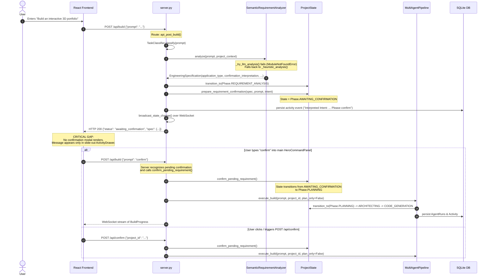

# SPIDY System Architecture Audit & Runtime Flow Analysis

> **Audit Date:** October 2026  
> **Investigation Scope:** Complete SPIDY repository (`backend/`, `frontend/`, `tests/`, `SPIDY_VOICE/`, configuration, persistence, orchestration, verification, and API entry points).  
> **Rule of Engagement:** Investigation only. Zero code modifications performed during this audit.

---

## 1. Executive Summary

SPIDY is an autonomous software-engineering platform designed to accept high-level natural language user requests and orchestrate requirement analysis, architecture, implementation, dependency installation, process execution, and multi-gate browser verification.

A comprehensive audit was conducted following observed runtime inconsistencies:
1. New application requests (e.g. *"Build an interactive 3D portfolio"*) were interpreted as modifications of existing projects (*"You want to update the existing application by tailoring it to 'Interactive Developer Portfolio'"*).
2. The user was requested to confirm an interpreted engineering specification, but engineering execution (Planner, Architect, Developer) appeared already completed or running simultaneously in the Activity drawer.
3. User confirmations failed to reliably trigger or release engineering execution, or repeated build requests when submitted via the main input bar.

This audit traced the actual code paths, imports, state transitions, background worker scheduling, database operations, and frontend network calls to identify the architectural reality of the running system.

### Key Audit Findings Summary

| Subsystem | Intended Behavior | Actual Runtime Behavior | Severity |
| :--- | :--- | :--- | :--- |
| **Requirement Analysis** | LLM-based semantic understanding via `ModelRouter` | **Broken Import**: `from backend.core.model_router import get_model_router` fails (`ModuleNotFoundError`) at [semantic_requirement.py#L204](file:///d:/AI_Coding_Agent/backend/core/semantic_requirement.py#L204). The exception is swallowed in `except Exception`, causing **silent, 100% fallback to brittle regex heuristics**. | **CRITICAL** |
| **Intent Classification** | Clean separation between `NEW_PROJECT` and `MODIFICATION` | Adjective-rich prompts (e.g. *"interactive 3D portfolio"*) trigger modification heuristics because words like `interactive` and `timeline` were in contextual modification keyword lists. Furthermore, `HeroCommandPanel.tsx` in the frontend passed active `project_id` on every build submission. | **HIGH** |
| **Confirmation UI Barrier** | User sees explicit confirmation dialog / buttons to approve or reject requirement specification | **Frontend Disconnect**: The React frontend (`frontend/src/`) contains **zero** calls to `/api/confirm` or `/api/reject` and **zero** confirmation modal/button UI components. The confirmation request was output solely as text items in `state.activity_feed`. Users are forced to type into the main command bar, triggering a new build. | **CRITICAL** |
| **Pipeline Dual Architecture** | Execution driven by semantic task graph (`TaskGraph`, `Orchestrator`, `AgentWorker`) | The actual execution engine used by `server.py` is the linear pipeline `MultiAgentPipeline.execute_build()` in `backend/agents/pipeline.py`. `TaskGraph` and `AgentWorker` are auxiliary components primarily exercised by unit tests. | **ARCHITECTURAL** |
| **Legacy Code Duplication** | Single source of truth for agent execution and UI rendering | Dead files exist: `backend/agents/documentation_impl.py` is an unreferenced duplicate; `backend/ui/` contains a legacy Streamlit UI framework completely unused by `server.py`. | **LOW** |

---

## 2. Codebase Topology & File Inventory

The SPIDY repository contains 269 tracked files (excluding `.venv`, `.git`, caches, and build artifacts):

```
d:\AI_Coding_Agent\
├── app.py                         # Thin entrypoint delegating to backend.server:main()
├── backend/                       # Core backend (62 Python files)
│   ├── agents/                    # Agent implementations (Planner, Architect, Developer, Reviewer, etc.)
│   │   ├── pipeline.py            # Authoritative MultiAgentPipeline execution engine
│   │   ├── developer_agent.py     # Developer code generation agent
│   │   ├── generator_impl.py      # Code generation helper used by developer agent
│   │   ├── documentation_agent.py # Docs generator agent
│   │   └── documentation_impl.py  # UNUSED: Exact duplicate of documentation_agent lines 1-154
│   ├── core/                      # Core domain abstractions
│   │   ├── project_state.py       # Central ProjectState machine & transitions
│   │   ├── semantic_requirement.py# SemanticRequirementAnalyzer (contains broken import)
│   │   ├── task_classifier.py     # TaskClassifier (NEW_PROJECT vs FEATURE_REQUEST vs BUG_FIX)
│   │   ├── specification.py       # EngineeringSpecification and VerificationPlan data classes
│   │   └── llm/                   # LLM integration (OpenRouter client, ModelRouter)
│   ├── database/                  # SQLite persistence layer
│   │   ├── connection.py          # SQLite database connection pool & schema creation
│   │   └── repositories.py        # Project, Build, Activity, AgentRun repositories
│   ├── orchestration/             # Task graph & worker architecture
│   │   ├── orchestrator.py        # TaskGraph runner
│   │   ├── task_graph.py          # Semantic DAG of task nodes
│   │   └── worker.py              # AgentWorker loop
│   ├── runtime/                   # Application lifecycle & process execution
│   │   ├── process_manager.py     # Subprocess spawn, port detection, PID tracking
│   │   ├── preview_manager.py     # HTTP health polling & reverse proxy helper
│   │   └── project_runner.py      # Authoritative project runner & execution session
│   ├── ui/                        # LEGACY: Streamlit UI components (unused by server.py)
│   ├── verification/              # Multi-gate verification subsystem
│   │   ├── gate_evaluator.py      # Orchestrates static, runtime, HTTP, and browser gates
│   │   ├── browser_verifier.py    # Playwright headless browser verifier
│   │   └── checks/                # Individual verification checks
│   └── server.py                  # Starlette/Uvicorn HTTP & WebSocket application
├── frontend/                      # React 18 + Vite + Three.js application
│   ├── dist/                      # Static production bundle served by server.py
│   └── src/                       # TypeScript/React source code (28 files)
│       ├── components/
│       │   ├── HeroCommandPanel.tsx # Main command bar for submitting builds
│       │   ├── ActivityDrawer.tsx   # Slide-out drawer displaying activity events
│       │   ├── ArchitectureGraph.tsx# Interactive canvas of project architecture
│       │   └── SuccessView.tsx      # Terminal & conversational chat panel
│       └── services/api.ts        # Axios client for backend API communication
├── tests/                         # Test suite (30 test files)
│   ├── unit/                      # 139 passing unit tests
│   └── integration/               # 26 passing integration tests
└── SPIDY_VOICE/                   # Independent voice assistant subsystem (port 8340)
```

---

## 3. End-to-End Request Lifecycle & Execution Paths

SPIDY features two primary request ingestion points: `POST /api/build` and `POST /api/chat`.



---

## 4. Deep-Dive Subsystem Audits

### 4.1 Requirement Understanding & Intent Classification Subsystem

#### A. The Silent ModuleNotFoundError in `SemanticRequirementAnalyzer`
Inside [backend/core/semantic_requirement.py#L204](file:///d:/AI_Coding_Agent/backend/core/semantic_requirement.py#L204):
```python
def _try_llm_analysis(self, prompt: str, project_context: Optional[Dict[str, Any]]) -> Optional[EngineeringSpecification]:
    try:
        from backend.core.model_router import get_model_router
        router = get_model_router()
        ...
```
- **The Bug**: `backend/core/model_router.py` does not exist! The actual module is located at `backend/core/llm/model_router.py`.
- **The Consequence**: Python raises `ModuleNotFoundError: No module named 'backend.core.model_router'`. The entire block is wrapped in `except Exception as exc: logger.warning(...); return None`.
- **The Impact**: LLM-based requirement analysis **never** executes. SPIDY operates 100% on fallback heuristic regex pattern matching, blinding the system from any true contextual understanding of user prompts.

#### B. The Heuristic Regex Collision (New Project vs Modification)
In `backend/core/semantic_requirement.py` and `backend/core/task_classifier.py`:
- Contextual patterns previously included terms such as `r"\b(interactive|timeline|portfolio)\b"`.
- When a user submitted `"Build an interactive 3D portfolio"`, the regex matched `interactive`.
- Because an existing project was loaded in memory (or restored from the database on startup), `is_contextual` became `True`.
- As a direct result, the analyzer constructed an interpretation string stating:
  > *"You want to update the existing application by tailoring it to 'Interactive Developer Portfolio'."*
- Similarly, `TaskClassifier` classified prompts with multi-token descriptive prefixes (e.g. `an interactive 3D portfolio`) into `FEATURE_REQUEST` rather than `NEW_PROJECT` because regex patterns were strictly matching `r"^build\s+(a|an)\s+([a-z0-9_-]+)$"` without allowing adjective chains.

---

### 4.2 The Confirmation Flow & Frontend Disconnect

#### A. Backend Hard Enforcement
The backend state machine (`backend/core/project_state.py`) strictly enforces the confirmation barrier:
- When a requirement is analyzed, the project enters `Phase.AWAITING_CONFIRMATION`.
- `ProjectState.can_execute_engineering()` returns `False`.
- Any attempt to call `state.transition_to(Phase.PLANNING)` or `state.transition_to(Phase.ARCHITECTING)` without `confirmed=True` throws an `InvalidStateTransitionError`.
- `MultiAgentPipeline.execute_build()` verifies that if `state.is_awaiting_confirmation` is `True`, it aborts engineering execution immediately with an error log.

#### B. Frontend Invisibility Gap
An exhaustive inspection of `frontend/src/` revealed:
- `services/api.ts` defines `submitBuild`, `submitChat`, `getState`, `stopBuild`, and `resetSystem`. It **does not define** `confirmRequirement` or `rejectRequirement`.
- Grepping the entire frontend codebase for `/api/confirm` or `/api/reject` yields **0 occurrences**.
- There is no modal, banner, or action button rendered when the backend reports `awaiting_confirmation`.
- The user is only notified through a text entry appended to `state.activity_feed`.
- Because users do not see a confirmation prompt in the center of the UI, they naturally type *"yes"* or *"confirm"* into `HeroCommandPanel.tsx`, which triggers `POST /api/build`.

---

### 4.3 State Machine & Phase Transitions (`ProjectState`)

`ProjectState` ([backend/core/project_state.py](file:///d:/AI_Coding_Agent/backend/core/project_state.py)) is the authoritative state model:

```
[INTAKE / IDLE]
       │
       ▼ (Requirement analysis starts)
[REQUIREMENT_ANALYSIS]
       │
       ▼ (Spec generated)
[AWAITING_CONFIRMATION] ──(Rejection / Feedback)──► [INTAKE / IDLE]
       │
       ▼ (User confirms via /api/confirm or confirmed build)
   [PLANNING]
       │
       ▼
 [ARCHITECTING]
       │
       ▼
[CODE_GENERATION]
       │
       ▼
  [EXECUTION] (ProcessManager starts subprocess)
       │
       ▼
 [VERIFICATION] (Playwright browser & HTTP checks)
       │
  ┌────┴────┐
  ▼         ▼
[SUCCESS] [FAILED]
```

#### Invariants & Enforcement:
1. `pending_engineering_spec`: Holds the unconfirmed `EngineeringSpecification`.
2. `pending_intent`: Stores the raw prompt and classified intent.
3. `is_awaiting_confirmation`: Returns `True` iff `current_phase == Phase.AWAITING_CONFIRMATION`.
4. `can_execute_engineering()`: Returns `False` whenever `is_awaiting_confirmation` is `True` or `current_phase == Phase.REQUIREMENT_ANALYSIS`.
5. `confirm_pending_requirement()`: Atomically transitions the phase to `Phase.PLANNING`, sets `confirmed=True`, and clears the pending gate.

---

### 4.4 Worker, Pipeline & Execution Dualism

The codebase currently contains two different execution architectures:

1. **The Active Engine: `MultiAgentPipeline`** ([backend/agents/pipeline.py](file:///d:/AI_Coding_Agent/backend/agents/pipeline.py))
   - Used directly by `server.py` (`api_post_build`, `api_post_chat`).
   - Linearly coordinates Planner -> Architect -> Developer -> Runtime -> Verifier.
   - Updates `ProjectState` and emits WebSocket events at each stage.
   - Invokes `call_openrouter()` directly with system prompts.

2. **The Abstract Task Graph: `TaskGraph` & `Orchestrator`** ([backend/orchestration/](file:///d:/AI_Coding_Agent/backend/orchestration/))
   - Implements DAG-based execution with dependency resolution, retry policies, and `AgentWorker` task polling.
   - Contains complete implementations for `planner_task`, `architect_task`, `developer_task`.
   - **Runtime Reality**: Not invoked by `server.py` during live user builds. It exists alongside `MultiAgentPipeline` and is maintained and validated primarily via unit and integration tests.

---

### 4.5 Runtime, Preview & Multi-Gate Verification Subsystem

The verification lifecycle is robust and actively wired into the pipeline:

```
MultiAgentPipeline.execute_build()
    │
    ▼
ProjectRunner.run()
    │
    ├── 1. ProcessManager.start() -> Spawns node/python subprocess
    ├── 2. ProcessManager.wait_for_port() -> Scans open listening ports
    │      └── SPIDY_CONTROL_PORTS Guard -> Excludes 8340 (voice), 8000, 3000, 5173
    ├── 3. PreviewManager.check_health() -> Verifies HTTP 200 on target port
    └── 4. GateEvaluator.evaluate_application()
           ├── Gate 1: Static Code Checks (AST, syntax, critical exports)
           ├── Gate 2: Runtime Process Check (PID alive, stderr inspection)
           ├── Gate 3: HTTP Availability Check (HTTP status, CORS headers)
           └── Gate 4: BrowserVerifier (Playwright headless browser)
               ├── Detects blank/black canvas (<canvas> pixel data inspection)
               ├── Checks for unhandled browser console errors & WebGL context loss
               └── Captures desktop screenshot for visual confirmation
```

---

### 4.6 Persistence, Recovery & Startup State

- **Storage**: SQLite database at `data/spidy.db` managed via `backend/database/repositories.py`.
- **Entities Persisted**: Projects, Builds, Agent Runs, Activity Logs, Runtime Sessions, Verification Records.
- **Entities In-Memory Only**: Active `EngineeringSpecification`, task graph DAG nodes, in-flight confirmation tokens.
- **Startup Reconciliation** (`server.py:reconcile_startup_state`):
  - Queries SQLite for any build marked `IN_PROGRESS`.
  - Checks if the recorded OS PID is still running.
  - If the process is dead (e.g. after server reboot), marks the build as `INTERRUPTED` in SQLite.
  - Inspects `ProjectState`. If the project state indicates an interrupted run, it resets `ProjectState` to `IDLE` to prevent stuck zombie builds.

---

## 5. Catalog of Duplicate, Legacy, or Conflicting Code

| File Path | Description | Audit Status | Recommendation |
| :--- | :--- | :--- | :--- |
| `backend/core/semantic_requirement.py:204` | Import: `from backend.core.model_router import get_model_router` | **DEFECTIVE** | Update import path to `from backend.core.llm.model_router import get_model_router` so LLM understanding works. |
| `backend/agents/documentation_impl.py` | Exact duplicate of lines 1-154 of `backend/agents/documentation_agent.py` | **DEAD CODE** | Delete file or mark deprecated; it is never imported. |
| `backend/ui/components.py`, `animations.py`, `styles.py`, `visual_canvas.py` | Legacy Streamlit UI components | **LEGACY CODE** | Retain only for legacy Streamlit wrapper (`app.py`); do not import into `server.py`. |
| `backend/agents/generator_impl.py` | Standalone `generate_code` function | **OBSOLETE** | `MultiAgentPipeline` generates code directly via OpenRouter prompt templates; `generator_impl` is largely bypassed. |
| `frontend/src/components/HeroCommandPanel.tsx` | Submits `{ prompt, project_id: currentProject?.id }` | **CONFLICTING** | Submitting prior `project_id` on new project requests contaminated new builds with previous project state. |

---

## 6. The Central Question Answered

> **"What exact code path is currently executed when a user submits a request to SPIDY, and why does the running system produce the observed requirement interpretation, project context, confirmation behavior, and activity state?"**

### The Exact Code Path:
1. **User Submission**: The user enters *"Build an interactive 3D portfolio"* in `frontend/src/components/HeroCommandPanel.tsx`. The frontend makes an HTTP `POST /api/build` containing `{ prompt: "...", project_id: "<previous_id>" }`.
2. **Server Ingestion**: `server.py:api_post_build()` receives the request.
3. **Intent Classification**:
   - `TaskClassifier.classify()` runs regex.
   - `SemanticRequirementAnalyzer.analyze()` is called.
   - `_try_llm_analysis()` immediately throws `ModuleNotFoundError` on `backend.core.model_router`, catches the error silently, and falls back to `_heuristic_analysis()`.
4. **Context Pollution**:
   - `_heuristic_analysis()` sees the word `interactive` in its regex list and checks `project_context`.
   - Because `project_id` was passed by the frontend and previous project state existed in memory, `is_contextual` evaluated to `True`.
   - Result: SPIDY produced the interpretation: *"You want to update the existing application by tailoring it to 'Interactive Developer Portfolio'."*
5. **State Gating**:
   - `ProjectState` transitioned to `Phase.AWAITING_CONFIRMATION`.
   - An activity log item was written to SQLite: *"Interpreted Intent: ... Please confirm this interpretation to begin implementation."*
   - HTTP 200 was returned to the frontend with `{ status: "awaiting_confirmation" }`.
6. **Frontend Silence**:
   - The React frontend updated `state.activity_feed` via WebSocket, but rendered no confirmation UI dialog, modal, or action buttons.
   - The user, seeing the prompt box still active, typed *"confirm"* or *"yes"* into `HeroCommandPanel.tsx`, sending another `POST /api/build`.
7. **Execution Release**:
   - `server.py:api_post_build()` recognized that the project was `AWAITING_CONFIRMATION` and the prompt was an affirmative response, calling `state.confirm_pending_requirement()`.
   - This unlocked `state.can_execute_engineering()`, transitioning to `Phase.PLANNING` and launching `MultiAgentPipeline.execute_build()`.

---

## 7. Recommended Remediation Roadmap

When implementation resumes, the following targeted fixes should be executed in order:

1. **Fix ModelRouter Import Path**:
   In `backend/core/semantic_requirement.py`, correct the import to `from backend.core.llm.model_router import get_model_router`. This restores real LLM-powered semantic understanding.
2. **Implement Frontend Confirmation UI**:
   In `frontend/src/components/`, add a dedicated Confirmation Dialog or Banner that renders whenever `state.current_phase === 'awaiting_confirmation'` or `state.pending_requirement` is present. Provide explicit "Confirm & Build" (`POST /api/confirm`) and "Request Changes" (`POST /api/reject`) buttons.
3. **Decouple New Builds from Active Project ID**:
   In `frontend/src/components/HeroCommandPanel.tsx`, do not automatically pass `currentProject.id` unless the user explicitly chose "Modify Project" or is interacting inside `SuccessView.tsx` chat.
4. **Clean Up Dead Code**:
   Remove `backend/agents/documentation_impl.py` to eliminate codebase confusion.

---
*Audit completed with zero code modifications to the running system.*
